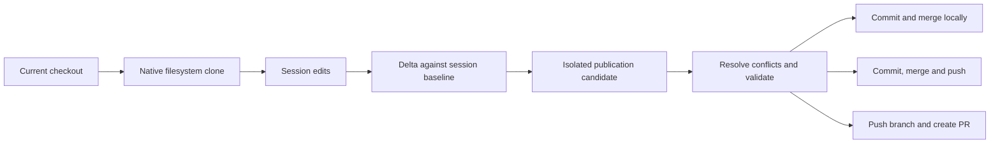

# Work isolation

Choose **Current checkout**, **New worktree**, or **New copy-on-write** in the
composer's Isolation menu. Settings → Work Isolation controls the default for
new sessions. The default is Local.

Copy-on-write requires APFS on macOS or Btrfs on Linux. MonoCode refuses normal
copy fallback. Unsupported repositories or filesystems show an explanation;
choose Local or a worktree explicitly.

A copy includes current files, dirty edits, ignored dependencies, and secrets
already present in the checkout. Its Git repository is independent, including
when the source is a linked worktree. External symlinks, nested repositories,
submodules, unresolved indexes, sparse/split indexes, shallow/partial clones,
and object alternates are rejected. Copy-on-write isolates files; provider
permissions, ports, databases, and external services keep their existing rules.

Inherited dirty edits and ignored files are excluded from publication. The
source-control panel shows session changes against the captured baseline,
including binary changes. Local merge requires a clean originating checkout
on the same branch and revision used to prepare publication. Conflict resolution
runs in a visible session with the same provider and permissions; publication
requires reported successful validation and backend path/index checks.

Publication receipts retain unfinished operations so failed pushes or PR
creation can be retried. Successful publication advances the baseline for
subsequent edits. Archived sessions retain their copies. Work Isolation settings
lists copies and offers cleanup when no live session owns them; deleting a
session can also delete its copy.

Verification: `npm run check`, `npm run test:host`, and `npm run host:package`.
Native integration tests use real Git repositories. Set `MONOCODE_REQUIRE_COW=1`
to require filesystem support; CI mounts a real Btrfs volume for Linux checks.
